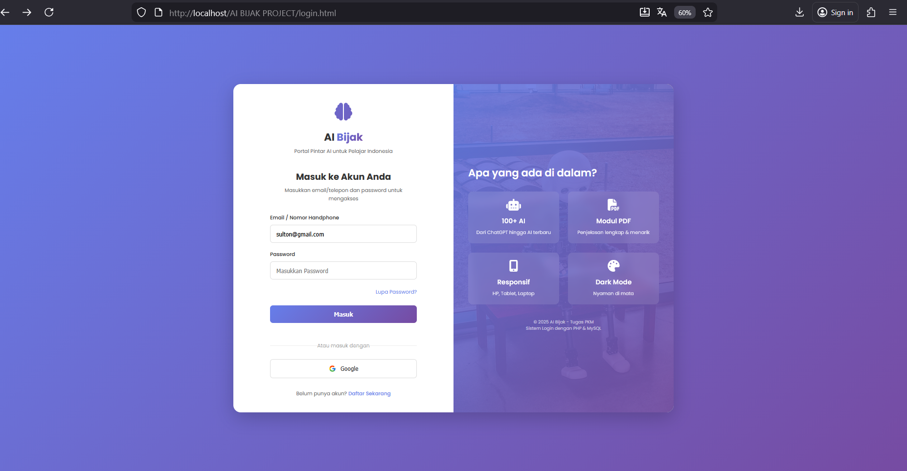
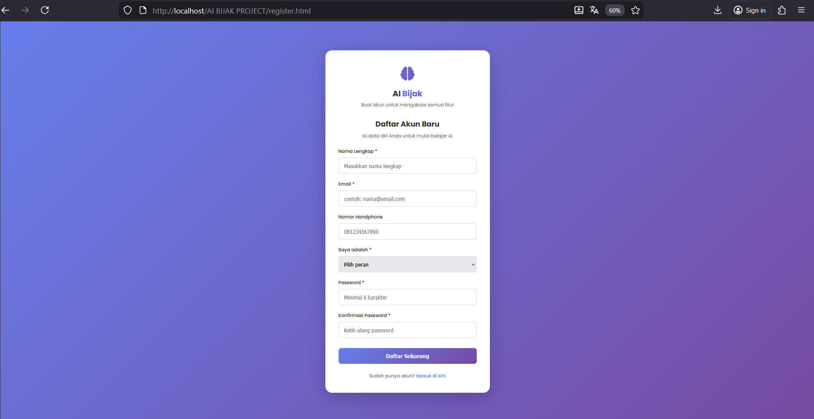
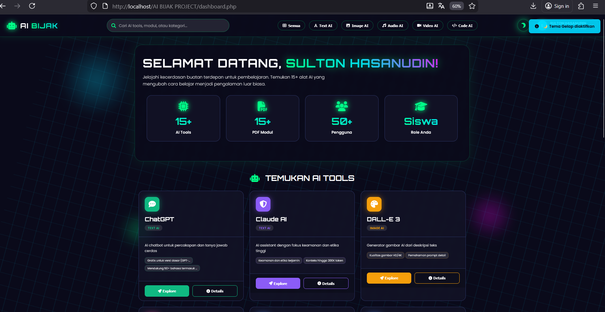
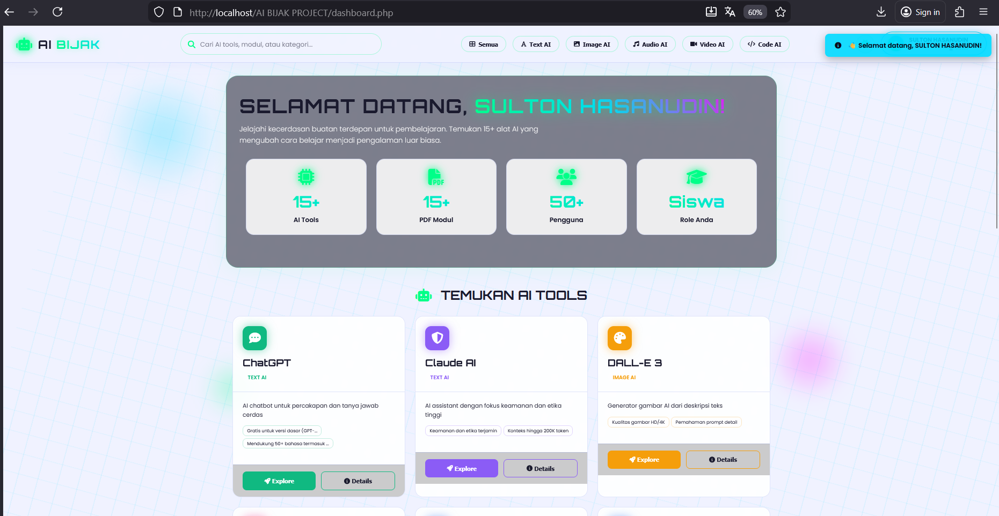
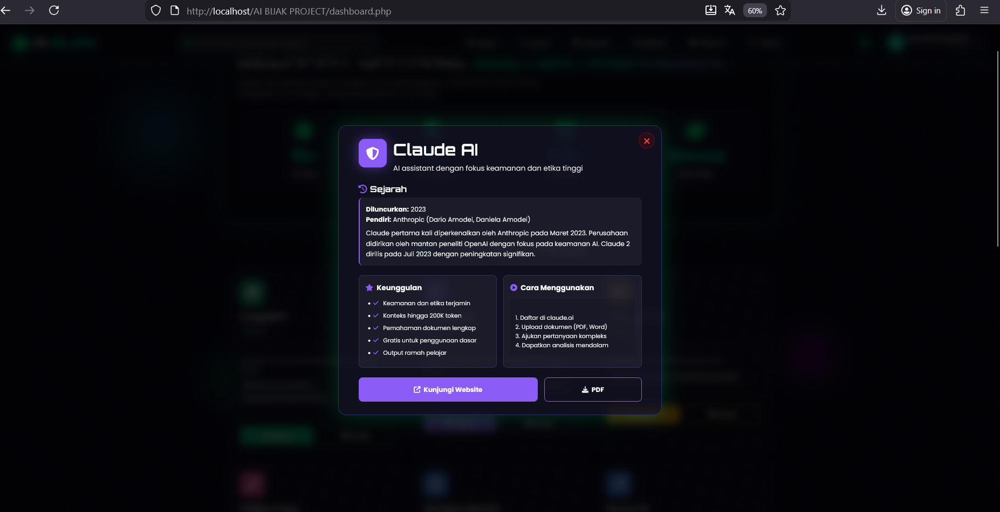

# AI BIJAK - Platform Pembelajaran AI

  <h1>🤖 AI BIJAK</h1>
  <h3>Platform Pembelajaran Kecerdasan Buatan untuk Pendidikan</h3>

## 📸 Screenshots & Demo

### 1. Authentication Pages
| Login Page | Registration Page |
|------------|-------------------|
|  |  |

### 2. Dashboard Interface
**Dark Mode:**  
  
*Tampilan dashboard dengan tema gelap*

**Light Mode:**  
  
*Tampilan dashboard dengan tema terang*

### 3. AI Tools Features
**AI Detail Modal:**  
  
*Modal untuk melihat detail AI tool*

**PDF Generator Output:**  
  
Hasil generate modul PDF

# Tentang Proyek
AI Bijak adalah platform pembelajaran kecerdasan buatan yang menyediakan katalog 15+ AI tools, modul PDF, dan fitur edukasi lengkap.

# Fitur Utama
Login dengan Email/Nomor HP
Dashboard Futuristik dengan Dark/Light Mode
15+ AI Tools dengan 5 Kategori
Generator Modul PDF
Responsive Design untuk Mobile & Desktop

# Teknologi
Frontend: HTML5, CSS3, JavaScript (ES6+)
Backend: PHP 8.2, MySQL
Libraries: jsPDF, Font Awesome 6
Database: MySQL dengan sistem autentikasi aman

# Instalasi
# Clone repository
git clone https://github.com/username/ai-bijak.git

# Pindah ke folder project
cd ai-bijak

# Setup database
# 1. Import database.sql ke phpMyAdmin
# 2. Konfigurasi config.php

👨‍💻 Pengembang
Sulton Hasanudin
📧 sultonhasanudin320@gmail.com
📱 0896-
📅 2025

📄 Lisensi
6. Save file (Ctrl + S)
# LANGKAH 2: Buat File .gitignore
1. Di VS Code, klik kanan di Explorer
2. New File
3. Beri nama: `.gitignore` (titik di depan penting!)
4. Copy teks di bawah ini dan paste:

# XAMPP
/xampp/
/htdocs/

# Environment
.env
config.php

# Logs
.log
npm-debug.log

# Runtime data
pids
.pid
.seed

# Dependency directories
node_modules/

# IDE
.vscode/
.idea/
.swp
.swo

# OS
.DS_Store
Thumbs.db

# Backup files
.bak
.backup

# Temporary files
tmp/
temp/

5. **Save file** (Ctrl + S)

# **🔄 STEP 2: SETUP GIT DI VS CODE**

# **LANGKAH 3: Install Git (Jika belum)**
1. **Download Git:** https://git-scm.com/downloads
2. **Install dengan semua default settings**
3. **Restart VS Code setelah install**

# **LANGKAH 4: Konfigurasi Git di Terminal VS Code**
1. **Buka Terminal di VS Code:** Tekan **Ctrl + `** (tombol backtick)
2. **Ketik perintah berikut satu per satu:**

# Set nama Anda
git config --global user.name "Sulton Hasanudin"

# Set email Anda
git config --global user.email "sultonhasanudin320@gmail.com"

# Initialize Repository

# Pilih folder project
cd /path/to/ai-bijak

# Initialize git
git init

# Tambahkan semua file
git add .

# Commit pertama
git commit -m "Initial commit: AI Bijak Platform v1.0"

# Cek status
git status

